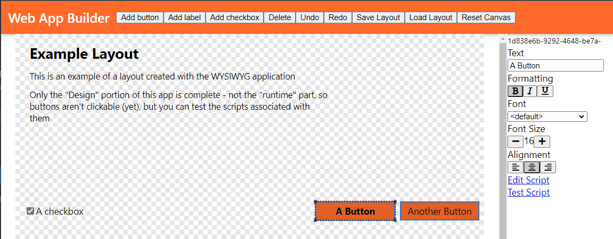

# Web-Based Editor

Web-based WYSIWYG webpage editor intended to allow easily creation webpages without the need to modify HTML or CSS.

Possible use cases:

- Winforms Designer like development of apps
- Displaying live data from another source (like a JSON-data source or spreadsheet)

## Goals

- WYSIWYG for positioning controls on web page, with inspiration from WinForms
- Availability of editable controls should be extensible
- How data is pushed into the control should be decided by the application integrator
- A properties panel should be available for editing the properties of the controls/including
- Controls should be able to be absolutely positioned but be able to resize as the page resizes (should support anchoring)
- The control layout should be able to change based on the constraints available (desktop vs mobile)
- Controls can be data-bound to a data source coming from an external device

## Current State

Right now, development is still at an early stage, but the foundation for editing of controls is in place, including a rudimentary script editor.  There is no runtime support - that is you can't deploy anything right now, only design them.



You can play with a snapshot of d3037a09383e9abb55df0b9326ae9dbb8ec77453 [on the web](https://programdotrun.com/snapshots/d3037a09383e9abb55df0b9326ae9dbb8ec77453/).

# Building

## Production

To build the current prototype, clone the repository and run:

```bash
npm install
npm run build
```

## Development

To start webpack in development mode, use the following:

```bash
npm install
npm run dev
```

Changes to files will then cause the webpage to reload
